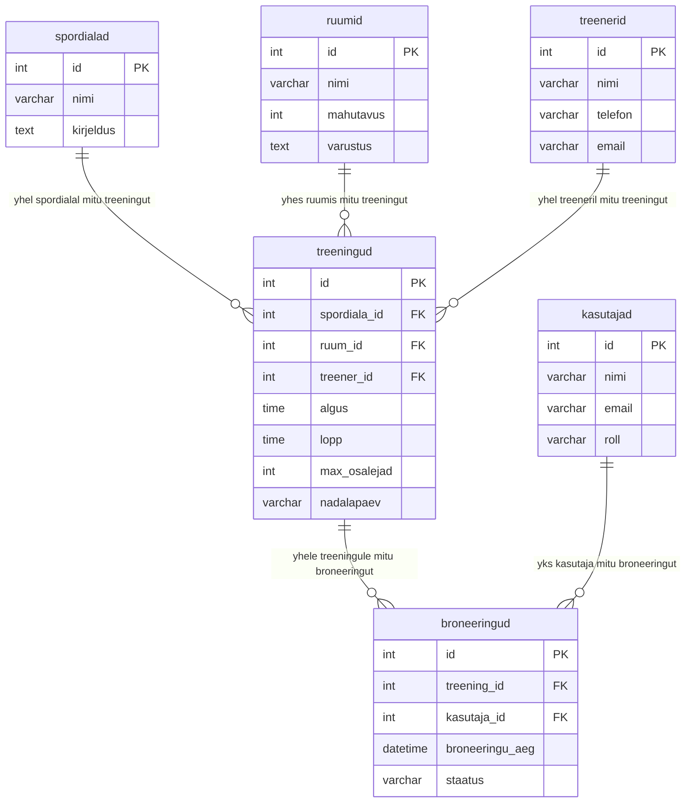

# Juhend: Andmemudel ja ERD

## Mis see on

Andmemudel on sinu andmebaasi joonis. Nagu maja joonis naritab kus on seinad, uksed ja aknad — andmemudel naritab mis tabelid sul on, mis andmed neis on ja kuidas nad omavahel seotud on.

ERD (Entity-Relationship Diagram) on selle joonise vorming. Sa joonistad selle Mermaid sunatksiga otse GitHubis.

## Miks see oluline on

Kui hakkad andmebaasi ehitama ilma mudelita, siis:
- unustad tabeleid
- teed valesid seoseid
- pead hiljem koik umber tegema

5 minutit joonistamist saastab 2 tundi parandamist.

## Pohimoisted

### Tabel (entity)

Tabel hoiab uhte tuupi andmeid. Naiteks "spordialad" tabel hoiab koiki spordialasid.

Igal tabelil on:
- Nimi (nt "spordialad")
- Valjad ehk veerud (nt "id", "nimi", "kirjeldus")
- Primaarvoti (PK) — unikaalne number mis eristab iga rida (tavaliselt "id")

### Seos (relationship)

Seos naritab kuidas tabelid on omavahel yhendatud.

Uks-mitmele (1:N): Uks spordiala voib omada mitut treeningut, aga iga treening kuulub uhele spordialale. Naiteks korvpallil on 3 treeningut nadalas — koik viitavad samale spordialale.

Mitu-mitmele (M:N): Uks opilane voib kaia mitmel treeningul ja uhel treeningul voib olla mitu opilast. Seda seost ei saa otse teha — vaja on vahetabelit (nt "broneeringud").

### Vootisvoti (FK — Foreign Key)

Vootisvoti on valja mis viitab teise tabeli primaarvotmele. See loob seose tabelite vahel.

Naiteks tabelis "treeningud" on valja "spordiala_id" mis viitab tabelile "spordialad" — see tahendab et iga treening on seotud uhe spordialaga.

## Kuidas ERD joonistada

### Samm 1: Nimeta tabelid

Vota oma spordibaasi analyys (task 1) ja motele: mis tuupi andmeid on?

- Spordialad (korvpall, ujumine, jooga...)
- Ruumid (suur saal, jousaal, ujula...)
- Treenerid (kes juhendavad)
- Treeningud (millal, kus, mis spordiala)
- Kasutajad (opilased, treenerid, adminid)
- Broneeringud (kes on millisele treeningule registreerunud)

### Samm 2: Lisa valjad igale tabelile

Iga tabeli kohta motele: mis andmeid selle asja kohta hoitakse?

Naiteks "spordialad":
- id (number, unikaalne)
- nimi (tekst, nt "Korvpall")
- kirjeldus (pikk tekst)

### Samm 3: Maaratlae seosed

Kysi endalt:
- "Kas uhel spordialal voib olla mitu treeningut?" Jah -> 1:N
- "Kas uks opilane voib kaia mitmel treeningul?" Jah -> M:N (vahetabel)
- "Kas uks treening toimub mitmes ruumis korraga?" Ei -> 1:N (ruum -> treening)

### Samm 4: Joonista Mermaid sunatksiga

Loo fail docs/erd.md ja kirjuta sinna Mermaid kood. GitHub renderib selle automaatselt jooniseks.

## Mermaid sunatksi juhend

Mermaid ERD kirjutatakse nii:

```
erDiagram
    TABELI_NIMI {
        andmetuup valja_nimi PK "kommentaar"
        andmetuup valja_nimi FK
        andmetuup valja_nimi
    }
```

Seosed:
```
TABEL1 ||--o{ TABEL2 : "selgitus"
```

Seoste sümbolid:
- `||` = tapselt uks (1)
- `o{` = null voi mitu (0..N)
- `|{` = uks voi mitu (1..N)

Ehk `||--o{` tahendab "uks mitmele" (1:N).

## Naide — SportBase ERD



## Levinud vead

1. Puudub primaarvoti (PK) — iga tabelis PEAB olema id valja
2. Puudub vootisvoti (FK) — kui tabelid ei viita uksteisele, nad ei ole seotud
3. M:N seos ilma vahetabelita — sa EI SAA otse yhendada opilast ja treeningut, vaja on vahetabelit (broneeringud)
4. Vale andmetuup — kuupaev peaks olema DATE mitte VARCHAR, number peaks olema INT mitte VARCHAR

## Kontroll-kusimused

Enne kui edasi lahed:
- Kas igal tabelil on PK?
- Kas iga FK viitab olemasolevale tabelile?
- Kas koik Task 1 andmed mahuvad sinu tabelitesse?
- Kas Mermaid renderib GitHubis? (pusha ja vaata)

## Allikad

- Mermaid ER diagram docs: https://mermaid.js.org/syntax/entityRelationshipDiagram.html
- W3Schools SQL: https://www.w3schools.com/sql/
- AI prompt: "Selgita mis vahe on 1:N ja M:N seosel andmebaasis, too naide broneerimissusteemist"
